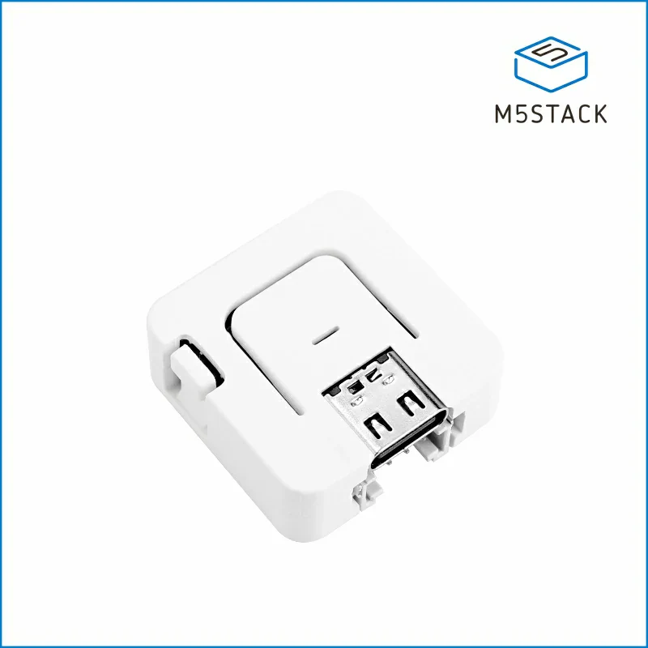

# M5 PTT — BLE & USB MIDI Footswitch

A push-to-talk (PTT) MIDI controller for M5Stack **AtomS3 Lite** (ESP32-S3).
Pressing a footswitch or the built-in button sends a MIDI note over either
Bluetooth LE MIDI or native USB MIDI. Designed for use with **SmartSDR on iOS**
as a wireless/wired PTT.

<p align="center">
  
</p>

> ⚡ Just want to install it? Flash the latest firmware from your browser at
> **[m5ptt.ok1cdj.com](https://m5ptt.ok1cdj.com)** — no IDE, no drivers. See
> [Flash from your browser](#flash-from-your-browser-recommended).
>
> 📖 Operating the device? See the **[User Manual](USER_MANUAL.md)**.

## How it works

Two operating modes, selected at boot:

- **Voice mode** (default): the footswitch or built-in button is push-to-talk.
- **CW mode**: the built-in button triggers CWX keyer memories by click count
  (footswitch is ignored). Booting into CW mode flashes **R** (·−·) to confirm.

The mode is **remembered across power cycles** (stored in flash). Hold the
built-in button while powering on to **toggle** between voice and CW; the new
mode is saved and used on subsequent boots until you toggle again.

The device presents as `M5PTT` over USB and as `M5PTT_XXXX` over BLE (the
`XXXX` suffix is the last two bytes of the BLE MAC, so each unit is unique).

### MIDI notes (channel 1)

All actions are momentary note pulses; map them in SmartSDR's Mapping Editor.

| Action | Note | Map to |
|---|---|---|
| Voice PTT | 99 | PTT (Note On press / Note Off release) |
| CW single click | 95 | CWX macro 1 |
| CW double click | 96 | CWX macro 2 |
| CW triple click | 97 | CWX macro 3 |
| CW long press | 98 | CWX stop / abort |

Single-click resolves after a ~350 ms window (needed to distinguish double/triple
click); a long press (~600 ms) fires the abort note.

### Transport selection (automatic, mutually exclusive)

The active transport is chosen automatically so the host never receives
duplicate notes over two links:

| Power / connection | Active transport | Bluetooth |
|---|---|---|
| Plugged into a USB **host** (computer / iPad) | **USB MIDI** | dropped, advertising off |
| Powered from a **charger / power bank** (no data host) | **BLE MIDI** | advertising on |

When a USB host enumerates the device it becomes the sole transport: any BLE
client is disconnected and advertising stops. Unplug from the host and it falls
back to BLE and resumes advertising.

> **Testing note:** while cabled to a computer for flashing/serial, the device
> is in USB mode and BLE is off. To test the BLE path, power it from a plain
> USB charger or battery (not a data host).

## Hardware

| Function | Pin | Notes |
|---|---|---|
| External footswitch | GPIO1 | Grove port, G1 (yellow wire), `INPUT_PULLUP`, active-low |
| Built-in button | GPIO41 | active-low |
| Status LED | GPIO35 | 1× WS2812C RGB |
| USB | USB-C | Native USB / OTG (CDC serial + USB MIDI) |

Both inputs are debounced (50 ms).

### Status LED

| Color | Meaning |
|---|---|
| Red | PTT active |
| Green | USB host connected (USB MIDI active), idle |
| Solid blue / blue blink | Voice mode: BLE connected / advertising |
| Solid magenta / magenta blink | CW mode: BLE connected / advertising |
| Morse "R" at boot | CW mode confirmed |
| N white blinks | CW memory N sent (1/2/3) |
| Long red blink | CW abort sent |

## Building & flashing

### Flash from your browser (recommended)

The easiest way, no toolchain required. Open
**[m5ptt.ok1cdj.com](https://m5ptt.ok1cdj.com)** in Chrome, Edge, or Brave on a
desktop — Web Serial isn't available in Safari or on iOS/iPadOS — then:

1. Unplug the AtomS3 Lite.
2. Press and hold the top button, plug in a USB-C **data** cable while holding,
   and keep holding for ~2 s after it powers up. This enters download mode; the
   board has no auto-reset circuit, so it's needed every time you flash.
3. Click **Connect device**, pick the matching serial port, then release the
   button.
4. Wait for the flash to finish — that's it.

The page always serves the latest released firmware and shows its version next
to the install button.

### Build from source

Requires [PlatformIO](https://platformio.org/).

```sh
make all      # build
make upload   # flash over USB-C
make clean    # clean build artifacts
```

Serial monitor at 115200 baud (`pio device monitor`) — outputs a `[dbg]`
status line at 1 Hz plus `[BLE]`/`[USB]` transport-change events.

### Entering download mode

Because the firmware uses **native USB (OTG) mode** for USB MIDI, esptool's
automatic reset-to-bootloader does not work. Before `make upload`, put the
board in download mode manually:

1. Press and hold the top button for ~2 s until the internal LED turns green.
2. Release, then run `make upload`.

## Implementation notes

- **USB mode:** the AtomS3 board defaults to `ARDUINO_USB_MODE=1` (hardware
  USB-Serial/JTAG); this project forces `=0` (OTG/TinyUSB) in `platformio.ini`
  so it can enumerate as a USB MIDI device.
- **BLE advertising:** built explicitly — the 128-bit MIDI service UUID in the
  primary packet (so iOS recognizes it as MIDI) and the unique `M5PTT_XXXX` name
  in the scan response (it won't fit alongside the 128-bit UUID in one packet).
  No BLE *appearance* is advertised: `0x03C0` is the HID appearance, which made
  SmartSDR misclassify the device (stuck at "waiting for controller").
- **BLE connection state:** the BLE-MIDI library's connect callbacks don't fire
  under NimBLE-Arduino 2.x (changed virtual signature), so connection state is
  polled via `getConnectedCount()`.
- **Host-cached USB name:** the USB product string is `M5PTT`, but macOS/iOS
  CoreMIDI caches USB-MIDI names by VID:PID. If an old name persists, remove the
  stale device on the host.

## Power notes

Intended for USB or external power (AtomS3 Lite has no battery/PMIC). To stay
reliable with iOS BLE (which drops peripherals that miss connection events),
light sleep is **not** used. Power is instead reduced by never starting WiFi,
lowering BLE TX power to −12 dBm, shutting down BLE entirely when on USB, and
keeping the LED dim.

## License

MIT — see [LICENSE](LICENSE).
